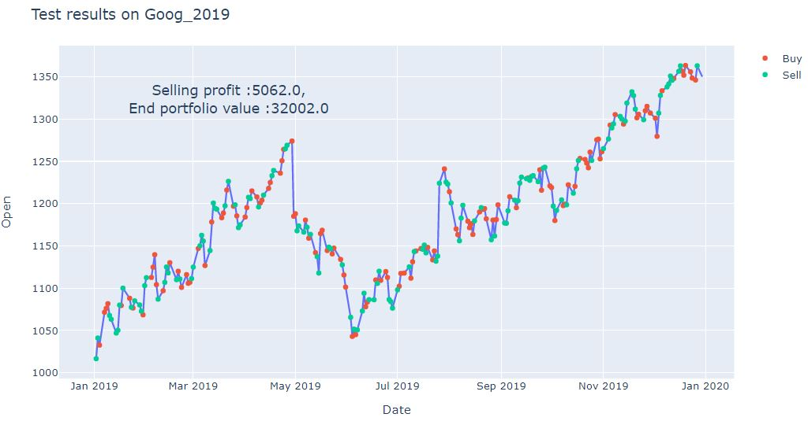
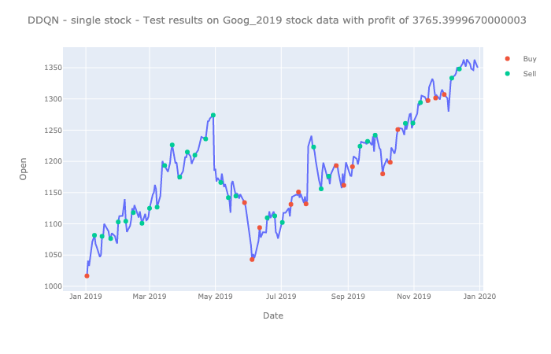

## Trading Bot implementation

Our goal for this project is to implement a stock trading bot which is capable of making intelligent decisions that increases the overall profit at a given time. We plan to implement and compare the results of three different techniques namely,  Deep Q-Learning, Double Deep Q-Learning, and Actor -Critic method.

#### Team Members

- [Thasleem Tajudeen](https://github.com/Thaslim)
- [Mohdi Habibi](https://github.com/mohdihabibi)
- [Rakesh Amireddy](https://github.com/rakeshamireddy)

#### Steps to run DQN 

    - python3 train.py data/GOOG.csv --episode-count 1000 --debug --window-size 5
    - python3 eval.py data/GOOG_2019.csv --window-size 5 --model-name model_dqn_1000 --debug
    
#### Steps to run Actor critic model
   - To test stock trading for single stock download [Trading_bot_AC.ipynb](Actor-Critic/Trading_bot_AC.ipynb) and [AC_model_1](Actor-Critic/AC_model_1) import packages by running the first cell and executed cells following the save model cell in the notebook file
   - To test stock trading for two stocks download [/Trading_bot_AC_2_stocks.ipynb](Actor-Critic/Trading_bot_AC_2_stocks.ipynb) and [AC_model_2](Actor-Critic/AC_model_2) import packages by running the first cell and executed cells following the save model cell in the notebook file

#### Steps to run DDQN
	- To train first cd to DDQN
	- Run python train.py
	- To test run python test.py

#### Actor-Critic Test Results

#### DQN Test Results

#### DDQN Test Results
